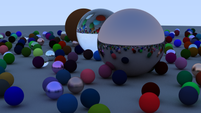
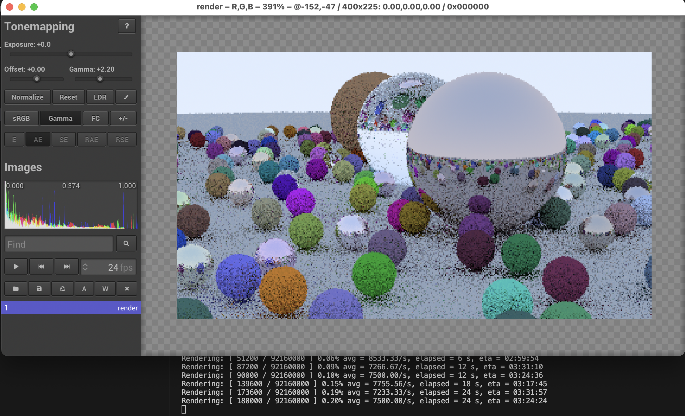

# lua-raytracer-in-one-weekend

Implementation of a simple raytracer in Lua, mostly following the structure of Peter Shirley's "[_Ray Tracing in One Weekend_]" series of books.



This scene was rendered in under 3 hours at 1024 samples per pixels, 400x225 resolution, on a single core of an M1 Pro.

## Features and limitations

* Support for [tev] image viewer. No PPM output, as in books, because tev can save OpenEXR, which is much much cooler.
* Progress view, showing the total amount of work, elapsed time, and estimated time of completion.
* BVH acceleration from the second book in the series.
* No depth-of-field or motion blur (those are boring).
* Everything is a sphere.
* Is literally my first attempt at coding in Lua, and trying to learn the idiomatic ways of doing things, as well as trying to keep it relatively fast.

## Usage

To run, start the raytracer from the command line, providing a scene file, and a number of samples.

```sh
lua rt.lua scenes/Final1.lua 64
```

### Tev support

Tev is an extremely fast image viewer with support for HDR images in many formats. This implementation can upload images to tev as they are being rendered.



[Install tev][tev], start it up and start the raytracer. Tev will now show and update the image as it's being rendered.

[_Ray Tracing in One Weekend_]: https://raytracing.github.io/books/RayTracingInOneWeekend.html
[tev]: https://github.com/Tom94/tev